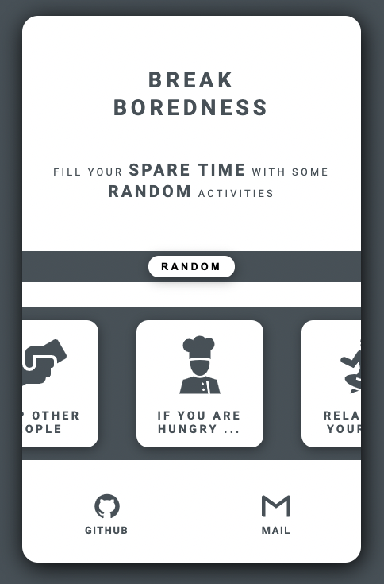

<h1> Break-Boredness </h1>

   
<b>Escape from boring time and get some fun! </b>

## Dependencies

[Go see package.json](./package.json)

- 리액트 (react, react icons, styled-components 등)
- eslint
- webpack
- babel
- etc (dotenv, prop-types 등)

## Webpack Setting

[Go see webpack config](./config/webpack.config.js)

style, css loader 등은 styled styled-components를 사용하는 관계로 설정하지 않음

- babel-loader
- devServer
